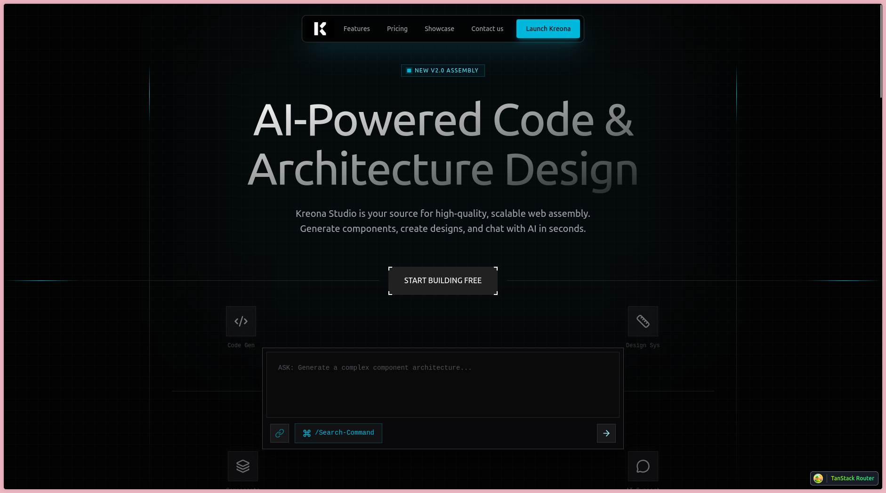

# Struct UI - Landing 02 (Kreona Studio)

A high-performance, dark-mode landing page designed for AI Coding Studios and SaaS products. Features complex "beam" animations, interactive bento grids, and a functional-looking terminal interface.



## Features

- **Hero Beam Animations**: Complex SVG-based beam animations using CSS keyframes and tails.
- **Interactive Bento Grid**: "Architecture" section with animated tree visualizations and token counters.
- **Spotlight Cards**: Pricing section featuring mouse-tracking spotlight hover effects.
- **Motion System**: Polished interactions using specific bezier curves and scroll reveals.
- **Functional UI Elements**: Terminal-like interfaces and code-generation visualizations.

## Tech Stack

- TanStack Start
- TanStack Router
- Tailwind CSS (v4)
- Lucide React
- CSS Variables & Custom Keyframes

## Getting Started

1. Install dependencies:
   ```bash
   pnpm install
   ```

2. Run development server:
   ```bash
   pnpm dev
   ```

3. Build for production:
   ```bash
   pnpm build
   ```
