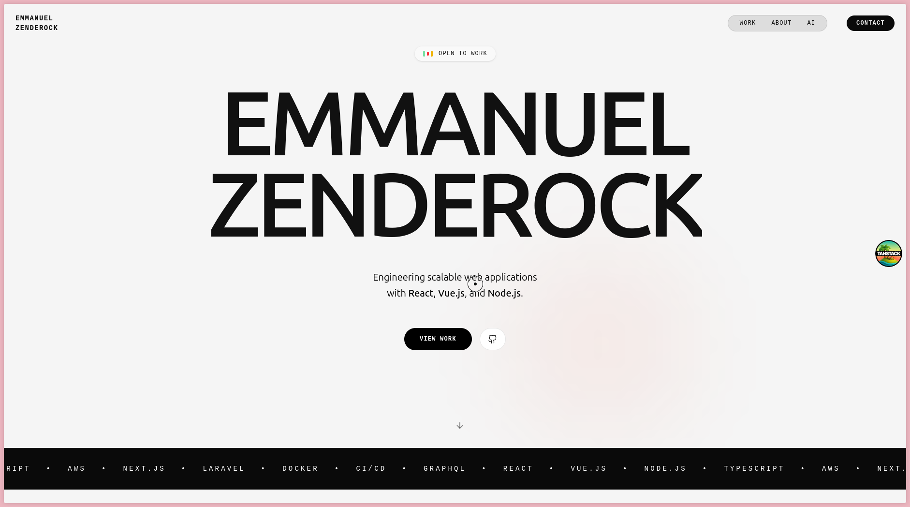

# Struct UI - Portfolio Template (Portfolio 01)

A high-performance, motion-driven portfolio template built with TanStack Start. Features a custom AI terminal, Lenis smooth scrolling, and a polished "magnetic" interaction system.



## Features

- **Interactive AI Terminal**: Embedded terminal that parses natural language queries about your resume.
- **Motion System**: Custom GSAP animations, reveal effects, and "magnetic" button interactions.
- **Smooth Scrolling**: Integrated Lenis scroll for a premium feel.
- **Component Architecture**: Modular design for easier customization (Hero, Projects, About, Contact).
- **Global Styles**: Centralized design system using Tailwind CSS and custom fonts.

## Tech Stack

- TanStack Start
- TanStack Router
- Tailwind CSS
- GSAP & Lenis
- Lucide React

## Getting Started

1. Install dependencies:
   ```bash
   pnpm install
   ```

2. Run development server:
   ```bash
   pnpm dev
   ```
